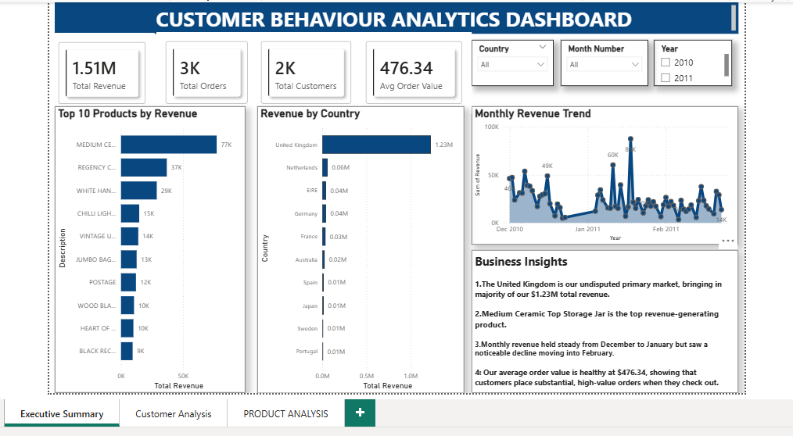
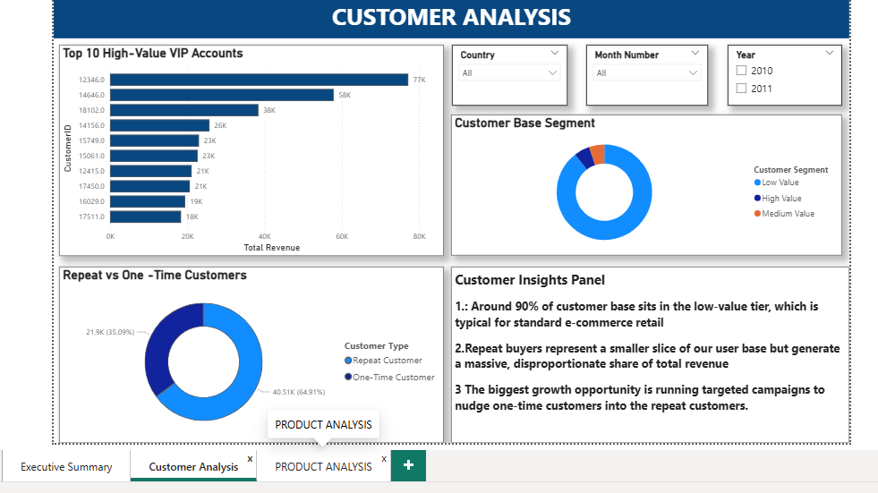
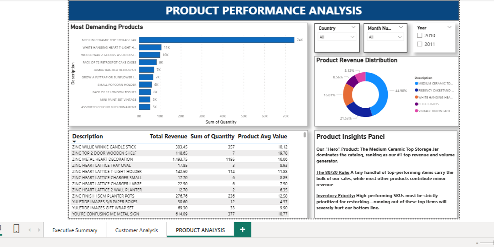

# Customer Behaviour Analytics Project

## Project Overview

Retail businesses generate large amounts of transactional data every day.
However, raw data alone cannot help businesses make decisions unless it is cleaned, analyzed, and visualized properly.

This project focuses on transforming raw online retail transaction data into meaningful business insights that can help understand:

* Customer purchasing behaviour
* Revenue performance
* Product trends
* Customer segmentation
* Sales growth patterns

The project simulates a real-world business analytics workflow followed by data analysts.


I created this project to strengthen my skills in:

* Data Cleaning
* SQL Analysis
* Business Intelligence
* Dashboard Design
* End-to-End Data Analytics Workflow

The complete project covers the journey from raw Excel data to interactive business dashboards.

---

# Tools & Technologies Used

* Python
* Pandas
* MySQL
* Power BI
* Excel

---

# Project Workflow

## 1. Data Cleaning using Python

The raw dataset contained:

* Missing customer IDs
* Duplicate transactions
* Cancelled orders
* Negative quantities
* Invalid prices

Using Python and Pandas, I cleaned the dataset by:

* Removing null values
* Removing duplicate rows
* Filtering cancelled orders
* Removing negative quantity and price values
* Creating a Revenue column
* Extracting Month and Year from Invoice Date

This prepared the data for further SQL analysis and dashboard creation.

---

## 2. SQL Business Analysis

After cleaning the data, the dataset was imported into MySQL for business analysis.

Several analytical queries were performed, including:

* Total Revenue
* Total Customers
* Total Orders
* Revenue by Country
* Top Customers
* Top Products
* Monthly Revenue Trend
* Running Revenue Analysis
* Customer Segmentation
* Repeat Customer Analysis
* Average Order Value

Advanced SQL concepts used:

* Window Functions
* CTEs
* Views
* Ranking Functions
* Aggregations

---

## 3. Power BI Dashboard

An interactive Power BI dashboard was created to visualize business insights in a simple and understandable way.

Dashboard pages include:

* Executive Overview
* Customer Analytics
* Sales & Product Analysis

The dashboard helps in understanding:

* Revenue trends
* Customer behaviour
* Product performance
* Country-wise sales
* Customer segmentation

---

# Key Business Insights

* Identified high-value customers contributing major revenue
* Found top-performing countries and products
* Analyzed monthly sales growth trends
* Segmented customers into High, Medium, and Low value groups
* Identified repeat purchasing behaviour
* Tracked revenue performance over time

---

# Project Structure

```
CUSTOMER_BEHAVIOUR_DATA_ANALYTICS_PROJECT
│
├── main.py
├── cleaned_online_retail.csv
├── 01_database_and_table_creation.sql
├── 02_basic_business_analysis.sql
├── 03_sales_trend_analysis.sql
├── 04_advanced_customer_analysis.sql
├── README.md
│
├── dashboard
│   └── customer_dashboard.pbix
│
└── screenshots
    ├── executive_overview.png
    ├── customer_analytics.png
    └── sales_analysis.png
```

---

## Dashboard Preview

### Executive Overview


### Customer Analytics


### Product Analysis

---

# What I Learned

Through this project, I improved my understanding of:

* Real-world data cleaning
* SQL analytical queries
* Business problem solving
* Dashboard storytelling
* Data visualization best practices
* End-to-end analytics workflow

This project helped me gain practical experience in the complete data analytics process from raw data to business insights.

---

# Author
Manya Jain

## License

This project is licensed under the MIT License - see the LICENSE file for details.